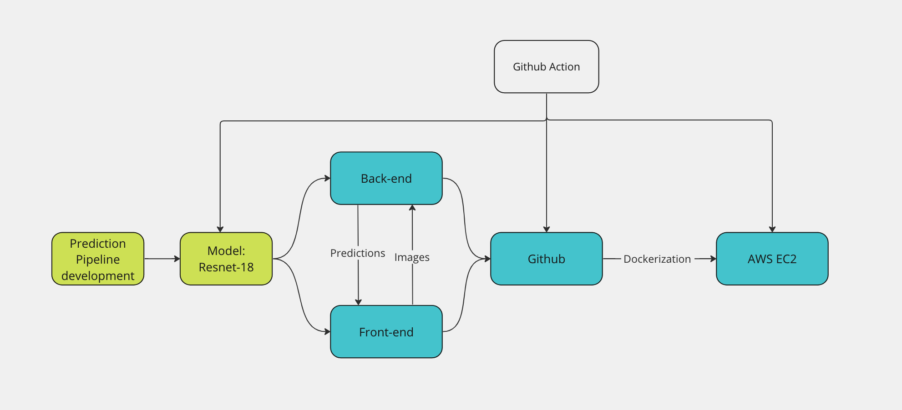
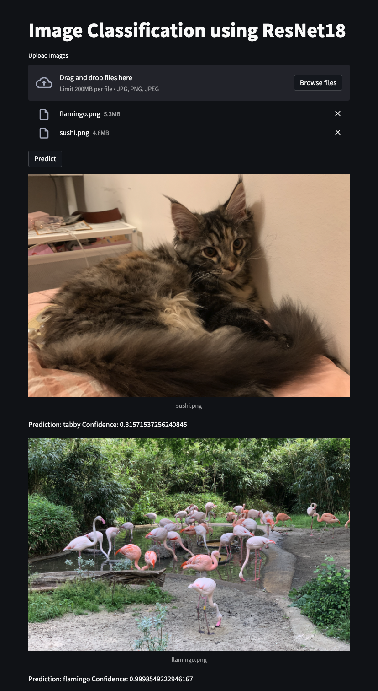
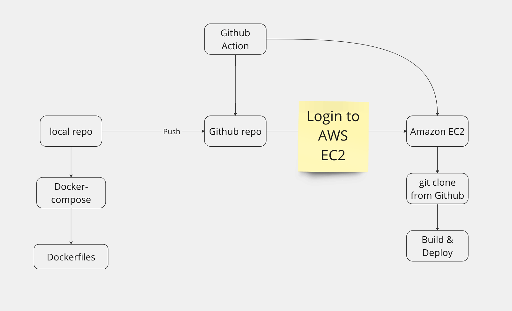

# Image classification webapp using Resnet-18

This image classification web application is developed for educational purpose, in order to get hands dirty on some DevOps tools. Here are some tools/frameworks used in this project:
* Pytorch
* Docker
* Streamlit
* FastAPI
* Github Action
* AWS EC2

## Model 
The model is a pre-trained ResNet18 model. The image preprocessing and prediction pipeline are first conducted in a jupyter notebook, and are then moved to the backend. It can support batch prediction. 

## System
Here's an overview of the system.  

 
### Front-end
The front-end is developed using Streamlit. A python library that can easilt build front-end interface without requiring additional html/css/javascript knowledege. Currently, it only supports outputing the prediction confidence of multiple given images. More functions will be added in the future.

### Back-end
The back end is developed using FastAPI.FastAPI is a powerful and easy-to-use web framework that can be used to build high-performance APIs with minimal effort. The model predcition pipline is placed on the back-end sides, which includes data normalization and image prediction. After receiving post requests from front-end side, it will send back 10 classes with the highest probabilities(however, only the top-1 prediction will be shown in front-end). 

### Deployment 
We use Github Action to implement the CI/CD pipeline in this project. The app is deployed on AWS EC2 instance. The front-end and back-end are containerzied separately, and docker-compse is used to manage the dependencies between two contaiers here, as well as build the images and run containers. Below is the workflow of the CI/CD pipeline. 

### Future works
- Implement Rolling updates
    - [ ] docker stack or Kubernetes
    - [ ] or Blue-gree deployment
- Optimize CI/CD pipeline
  - [ ] Build images in Github Action Runner and push to container registry. Pull images from container registry on servers.
  - [ ] Implement data ETL
  - [ ] Data analysis and visualization on front-end

