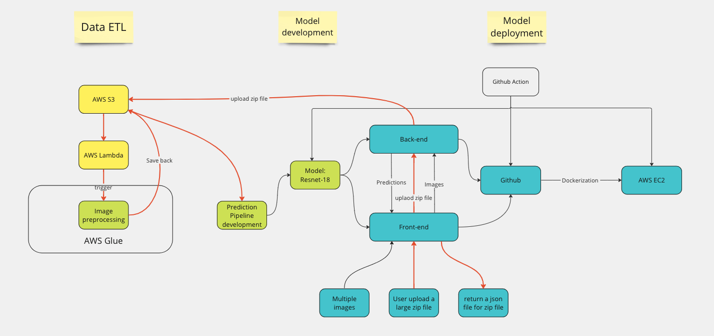
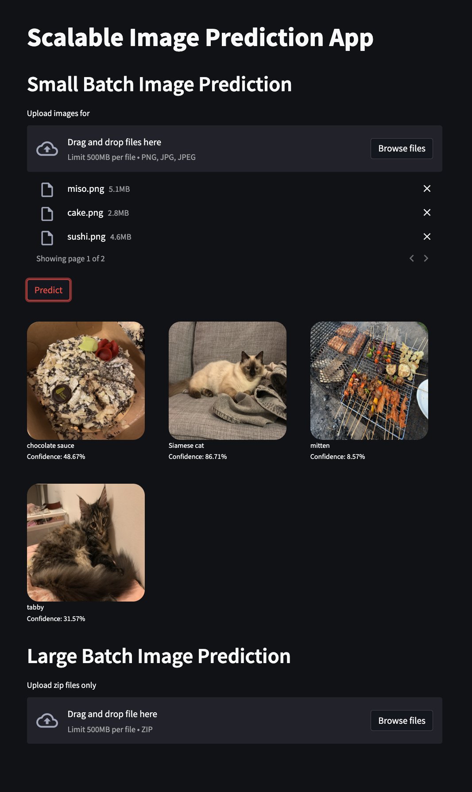
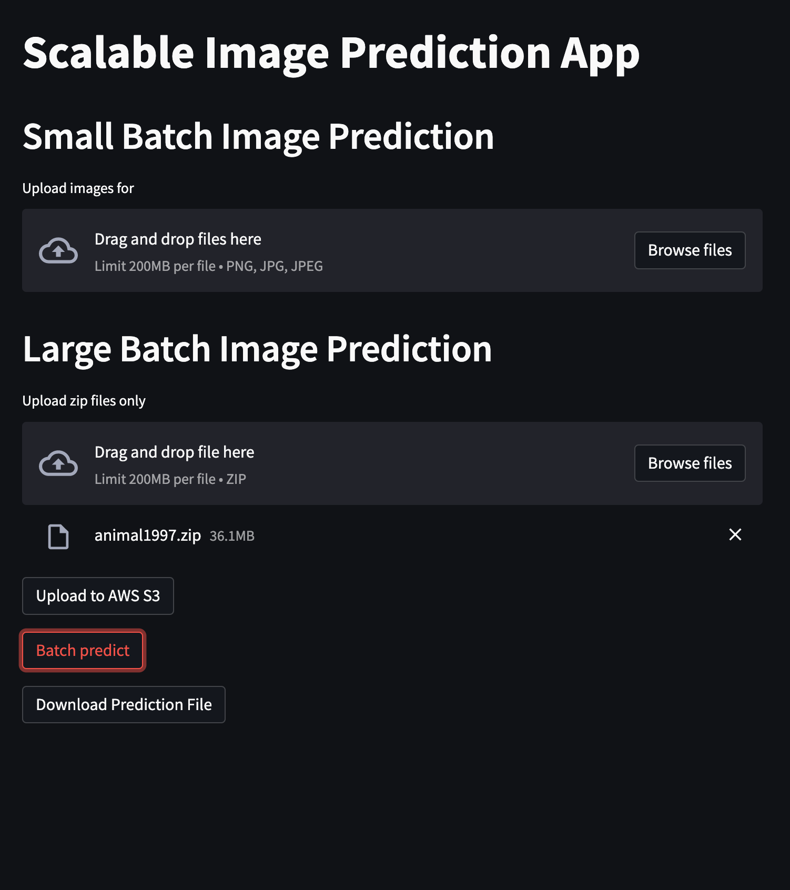

# Scalable Image Classification Web App using ResNet-18

This image classification web application is developed for educational purposes to gain hands-on experience with building an application with DevOps tools and cloud infrastructures. The following tools/frameworks are used in this project:
* Model implementation
  * Pytorch
  
* Deployment
  * Docker(Docker-compose)
  * Streamlit
  * FastAPI
  * Github Action 
  * AWS EC2
* Data ETL & Storage
  * AWS Lambda
  * AWS Glue
  * AWS S3

## Model 
The model used is a pre-trained ResNet18 model. The image preprocessing and prediction pipeline are initially implemented in a Jupyter notebook and later moved to the backend.

## System
The system divide its image prediction into two categories: small batch prediction and large batch prediction. For the former one, multiple images are accepted as inputs, and the processings and predictions are both conducted in inference server. For large batch prediction, we allow a zip file no larger than 500 MB as input and will be stored first on AWS S3. The system follows an event driven design where new zip filed on AWS S3 will trigger the preprocessing job on AWS Glue. After the preprocessing is done, AWS Glue will write the processed items back to AWS S3. Finally, the inference server will read preprocessed images from AWS S3 and make predictions. The large batch pipeline is shown in Figure below in red arrows. 
  
 

### Front-end
#### Small batch prediction
The front-end is developed using Streamlit, a Python library that allows building a user interface without the need for additional HTML/CSS/JavaScript knowledge. The front-end provides two input options for user: small batch prediction and large batch prediction. Users are allowed to upload the number of images no more than 9 at one time, for display purpose. The predicted results along with the uploaded images will be displayed in front-end.

#### Large batch prediction
For large batch prediction, users are allowed to upload a zip file no larger than 500 MB. Users need to first upload the selected file to AWS S3. Then, by clicking the <button>Batch predict</button>, the model starts to predict and will return a json file for users to download.

### Back-end
The back-end is developed using FastAPI, a powerful and easy-to-use web framework for building high-performance APIs with minimal effort. To support two types of input on the front-end side, we design two prediction pipelines on the back-end, supported by various cloud infrainstructure tools. For small batch prediction, the interaction is only happened between front-end and inference server, an AWS EC2 instance. The whole prediction pipeline is implemented in the EC2 instance, including image preprocessing and image prediction. For large batch prediction, we want to lower the workload of the inference server. Thus, preprocessing steps are moved to AWS Glue. After a zip file is uploaded to AWS S3, it will trigger the AWS Lambda to start a AWS Glue job to start processing uploaded zip file. What AWS Glue is exactly doing here is to center crop, resize and normalize images so that they can be directly used as input for ResNet-18. The AWS Glue will store the processed tensors on AWS S3. So, when <button>Batch predict</button> is clicked, the inference server will read processed from S3 bucket and return a json file to users.

### Deployment 
We use GitHub Actions to implement the CI/CD pipeline in this project. The app is deployed on an AWS EC2 instance. The front-end and back-end are containerized separately, and Docker Compose is used to manage the dependencies between the two containers, as well as build the images and run the containers. Below is the workflow of the CI/CD pipeline. 

### Future works
- [ ] Implement Rolling updates
 * docker stack or Kubernetes
 * Blue-gree deployment

- [ ] Optimize CI/CD pipeline
* Build images in Github Action Runner and push to container registry. Pull images from container registry on servers.
- [ ] Model monitoring and re-training. 

